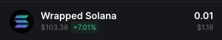

# Beyond Pump (BETA)

Beyond Pump is a software tool designed to automate the buying and selling of tokens on the Solana blockchain.
It is configured to execute trades based on predefined parameters and strategies set by the user.

The bot can monitor market conditions in real-time, such as pool burn, mint renounced and other factors, and it will execute trades when these conditions are fulfilled.

## Setup

To run the script you need to:

- Create a new empty Solana wallet
- Transfer some SOL to it.
- Convert some SOL to USDC or WSOL.
  - You need USDC or WSOL depending on the configuration set below.
- Configure the script by updating `.env.copy` file (remove the .copy from the file name when done).
  - Check [Configuration](#configuration) section bellow
- Install dependencies by typing: `npm install`
- Run the script by typing: `npm run start` in terminal

You should see the following output:

### Configuration

#### Wallet

- config/walletKeys.txt - Your wallet's private key.

#### Connection

- `RPC_ENDPOINT` - HTTPS RPC endpoint for interacting with the Solana network.
- `RPC_WEBSOCKET_ENDPOINT` - WebSocket RPC endpoint for real-time updates from the Solana network.
- `COMMITMENT_LEVEL`- The commitment level of transactions (e.g., "finalized" for the highest level of security).

#### Bot

- `LOG_LEVEL` - Set logging level, e.g., `info`, `debug`, `trace`, etc.
- `ONE_TOKEN_AT_A_TIME` - Set to `true` to process buying one token at a time.
- `COMPUTE_UNIT_LIMIT` - Compute limit used to calculate fees.
- `COMPUTE_UNIT_PRICE` - Compute price used to calculate fees.
- `PRE_LOAD_EXISTING_MARKETS` - Bot will load all existing markets in memory on start.
  - This option should not be used with public RPC.
- `CACHE_NEW_MARKETS` - Set to `true` to cache new markets.
  - This option should not be used with public RPC.
- `TRANSACTION_EXECUTOR` - Set to `warp` to use warp infrastructure for executing transactions, or set it to jito to use JSON-RPC jito executer
  - For more details checkout [warp](#warp-transactions-beta) section
- `CUSTOM_FEE` - If using warp or jito executors this value will be used for transaction fees instead of `COMPUTE_UNIT_LIMIT` and `COMPUTE_UNIT_LIMIT`
  - Minimum value is 0.0001 SOL, but we recommend using 0.006 SOL or above
  - On top of this fee, minimal solana network fee will be applied

#### Buy

- `QUOTE_MINT` - Which pools to swap, USDC or WSOL.
- `QUOTE_AMOUNT` - Amount used to swap each new token.
- `AUTO_BUY_DELAY` - Delay in milliseconds before buying a token.
- `MAX_BUY_RETRIES` - Maximum number of retries for buying a token.
- `BUY_SLIPPAGE` - Slippage %
- `BUY_AMOUNT_SOL` - Amount of SOL to buy each token.

#### Sell

- `AUTO_SELL` - Set to `true` to enable automatic selling of tokens.
  - If you want to manually sell bought tokens, disable this option.
- `MAX_SELL_RETRIES` - Maximum number of retries for selling a token.
- `AUTO_SELL_DELAY` - Delay in milliseconds before auto-selling a token.
- `PRICE_CHECK_INTERVAL` - Interval in milliseconds for checking the take profit and stop loss conditions.
  - Set to zero to disable take profit and stop loss.
- `PRICE_CHECK_DURATION` - Time in milliseconds to wait for stop loss/take profit conditions.
  - If you don't reach profit or loss bot will auto sell after this time.
  - Set to zero to disable take profit and stop loss.
- `TAKE_PROFIT` - Percentage profit at which to take profit.
  - Take profit is calculated based on quote mint.
- `STOP_LOSS` - Percentage loss at which to stop the loss.
  - Stop loss is calculated based on quote mint.
- `SELL_SLIPPAGE` - Slippage %.

#### Filters

- `FILTER_CHECK_INTERVAL` - Interval in milliseconds for checking if pool match the filters.
  - Set to zero to disable filters.
- `FILTER_CHECK_DURATION` - Time in milliseconds to wait for pool to match the filters.
  - If pool doesn't match the filter buy will not happen.
  - Set to zero to disable filters.
- `CONSECUTIVE_FILTER_MATCHES` - How many times in a row pool needs to match the filters.
  - This is useful because when pool is burned (and rugged), other filters may not report the same behavior. eg. pool size may still have old value

##### Advanced Filters

- `HOLDER_DISTRIBUTION_FILTER` - Set to `true` to enable the holder distribution filter.

  - `MAX_TOP_HOLDER_SHARE` - Maximum percentage a single holder can own (default: 10%).
  - `MAX_TOP10_HOLDER_SHARE` - Maximum percentage top 10 holders can own combined (default: 30%).
- `DEV_CLEARED_FILTER` - Set to `true` to enable the developer cleared filter.

  - `MAX_DEV_PERCENTAGE` - Maximum percentage a developer can own (default: 10%).
  - Ensures that developers have reduced their position to a reasonable level.
- `SNIPER_CLEARED_FILTER` - Set to `true` to enable the sniper cleared filter.

  - Checks if early traders (snipers) have cleared their positions.
  - Helps avoid buying tokens where early traders might dump soon.
- `PROGRESS_IN_RANGE_FILTER` - Set to `true` to enable the price progress filter.

  - `MAX_PROGRESS` - Maximum bonding curve progress percentage (default: 40%).
  - `MIN_PROGRESS` - Minimum bonding curve progress percentage (default: 0%).
  - Ensures token price hasn't moved too far along the bonding curve.
- `FUND_SOURCE_FILTER` - Set to `true` to enable the fund source filter.

  - `CHECK_FUND_SOURCE` - Enable checking the source of funds for top holders.
  - `MAX_SAME_SOURCE_WALLETS` - Maximum number of wallets allowed from the same source.
  - `MIN_SOL_AMOUNT` - Minimum SOL amount for trades to be considered.
  - Prevents buying tokens where multiple top holders received funds from the same source.
- `BUNDLED_BUY_FILTER` - Set to `true` to enable the bundled buy filter.

  - `MAX_BUNDLED_WALLETS` - Maximum number of top holders allowed to have bought in the same or adjacent blocks (default: 4).
  - `SLOT_WINDOW` - The slot window range to consider for bundled buys (default: 10).
  - Prevents buying tokens where multiple top holders bought in a coordinated manner.
- `TRADE_VOLUME_FILTER` - Set to `true` to enable the trade volume filter.

  - Checks if the token has sufficient trading volume.
  - Helps ensure there is adequate liquidity and trading activity.

## Warp transactions (beta)

In case you experience a lot of failed transactions or transaction performance is too slow, you can try using `warp` for executing transactions.
Warp is hosted service that executes transactions using integrations with third party providers.

Using warp for transactions supports the team behind this project.

### Security

When using warp, transaction is sent to the hosted service.
**Payload that is being sent will NOT contain your wallet private key**. Fee transaction is signed on your machine.
Each request is processed by hosted service and sent to third party provider.
**We don't store your transactions, nor we store your private key.**

Note: Warp transactions are disabled by default.

### Fees

When using warp for transactions, fee is distributed between developers of warp and third party providers.
In case TX fails, no fee will be taken from your account.

## Common issues

If you have an error which is not listed here, please create a new issue in this repository.
To collect more information on an issue, please change `LOG_LEVEL` to `debug`.

### Unsupported RPC node

- If you see following error in your log file:`Error: 410 Gone:  {"jsonrpc":"2.0","error":{"code": 410, "message":"The RPC call or parameters have been disabled."}, "id": "986f3599-b2b7-47c4-b951-074c19842bad" }`it means your RPC node doesn't support methods needed to execute script.
  - FIX: Change your RPC node. You can use Helius or Quicknode.

### No token account

- If you see following error in your log file:`Error: No SOL token account found in wallet: `it means that wallet you provided doesn't have USDC/WSOL token account.
  - FIX: Go to dex and swap some SOL to USDC/WSOL. For example when you swap sol to wsol you should see it in wallet as shown below:

## Contact

- If you want to leave a tip, you can send it to the following address:
  8pfh939fhMZB2gyXvcoyLDumX4PcG212DKMg5MWWfxj7
- If you need custom features or assistance, feel free to contact the admin team on telegram for dedicated support.

## Disclaimer

The Solana Trading Bot is provided as is, for learning purposes.
Trading cryptocurrencies and tokens involves risk, and past performance is not indicative of future results.
The use of this bot is at your own risk, and we are not responsible for any losses incurred while using the bot.
