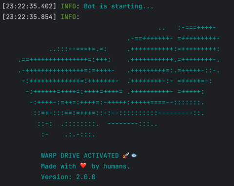

# Beyond Pump (BETA)

Beyond Pump 是一款设计用于自动化在 Solana 区块链上买卖代币的软件工具。它根据用户设定的预定义参数和策略执行交易。

该机器人能够实时监控市场条件，例如池子燃烧、铸币权放弃以及其他因素，并在这些条件满足时执行交易。

## 设置

要运行脚本，您需要：

- 创建一个新的空 Solana 钱包
- 向其中转入一些 SOL
- 将一些 SOL 转换为 USDC 或 WSOL
  - 根据下面设置的配置，您需要 USDC 或 WSOL
- 通过更新 `.env.copy` 文件配置脚本（完成后从文件名中删除 .copy）
  - 查看下面的[配置](#配置)部分
- 通过输入 `npm install` 安装依赖项
- 在终端中输入 `npm run start` 运行脚本

您应该看到以下输出：

### 配置

#### 钱包

- congif/walletKeys.txt - 您钱包的私钥

#### 连接

- `RPC_ENDPOINT` - 用于与 Solana 网络交互的 HTTPS RPC 端点
- `RPC_WEBSOCKET_ENDPOINT` - 用于从 Solana 网络获取实时更新的 WebSocket RPC 端点
- `COMMITMENT_LEVEL` - 交易的确认级别（例如，"finalized" 表示最高级别的安全性）

#### 机器人

- `LOG_LEVEL` - 设置日志级别，例如 `info`、`debug`、`trace` 等
- `ONE_TOKEN_AT_A_TIME` - 设置为 `true` 以一次处理一个代币的购买
- `COMPUTE_UNIT_LIMIT` - 用于计算费用的计算限制
- `COMPUTE_UNIT_PRICE` - 用于计算费用的计算价格
- `PRE_LOAD_EXISTING_MARKETS` - 机器人在启动时将所有现有市场加载到内存中
  - 此选项不应与公共 RPC 一起使用
- `CACHE_NEW_MARKETS` - 设置为 `true` 以缓存新市场
  - 此选项不应与公共 RPC 一起使用
- `TRANSACTION_EXECUTOR` - 设置为 `warp` 以使用 warp 基础设施执行交易，或设置为 `jito` 以使用 JSON-RPC jito 执行器
  - 有关更多详细信息，请查看 [warp](#warp-交易测试版) 部分
- `CUSTOM_FEE` - 如果使用 warp 或 jito 执行器，此值将用于交易费用，而不是 `COMPUTE_UNIT_LIMIT` 和 `COMPUTE_UNIT_PRICE`
  - 最小值为 0.0001 SOL，但我们建议使用 0.006 SOL 或更高
  - 除此费用外，还将应用最低的 Solana 网络费用

#### 买入

- `QUOTE_MINT` - 要交换的池子，USDC 或 WSOL
- `QUOTE_AMOUNT` - 用于交换每个新代币的金额
- `AUTO_BUY_DELAY` - 购买代币前的延迟（毫秒）
- `MAX_BUY_RETRIES` - 购买代币的最大重试次数
- `BUY_SLIPPAGE` - 滑点百分比

#### 卖出

- `AUTO_SELL` - 设置为 `true` 以启用自动卖出代币
  - 如果您想手动卖出已购买的代币，请禁用此选项
- `MAX_SELL_RETRIES` - 卖出代币的最大重试次数
- `AUTO_SELL_DELAY` - 自动卖出代币前的延迟（毫秒）
- `PRICE_CHECK_INTERVAL` - 检查止盈和止损条件的间隔（毫秒）
  - 设置为零以禁用止盈和止损
- `PRICE_CHECK_DURATION` - 等待止损/止盈条件的时间（毫秒）
  - 如果您没有达到盈利或亏损，机器人将在此时间后自动卖出
  - 设置为零以禁用止盈和止损
- `TAKE_PROFIT` - 获利的百分比
  - 止盈是基于报价铸币计算的
- `STOP_LOSS` - 止损的百分比
  - 止损是基于报价铸币计算的
- `SELL_SLIPPAGE` - 滑点百分比

#### 过滤器

##### 高级过滤器

- `HOLDER_DISTRIBUTION_FILTER` - 设置为 `true` 以启用持有者分布过滤器

  - `MAX_TOP_HOLDER_SHARE` - 单个持有者可以拥有的最大百分比（默认：10%）
  - `MAX_TOP10_HOLDER_SHARE` - 前 10 名持有者合计可以拥有的最大百分比（默认：30%）
- `DEV_CLEARED_FILTER` - 设置为 `true` 以启用开发者清仓过滤器

  - `MAX_DEV_PERCENTAGE` - 开发者可以拥有的最大百分比（默认：10%）
  - 确保开发者已将其持仓减少到合理水平
- `SNIPER_CLEARED_FILTER` - 设置为 `true` 以启用狙击手清仓过滤器

  - 检查早期交易者（狙击手）是否已清仓
  - 有助于避免购买早期交易者可能很快抛售的代币
- `PROGRESS_IN_RANGE_FILTER` - 设置为 `true` 以启用价格进度过滤器

  - `MAX_PROGRESS` - 最大绑定曲线进度百分比（默认：40%）
  - `MIN_PROGRESS` - 最小绑定曲线进度百分比（默认：0%）
  - 确保代币价格在绑定曲线上没有移动太远
- `FUND_SOURCE_FILTER` - 设置为 `true` 以启用资金来源过滤器

  - `CHECK_FUND_SOURCE` - 启用检查顶级持有者的资金来源
  - `MAX_SAME_SOURCE_WALLETS` - 允许来自同一来源的最大钱包数量
  - `MIN_SOL_AMOUNT` - 被考虑的交易的最小 SOL 金额
  - 防止购买多个顶级持有者从同一来源接收资金的代币
- `BUNDLED_BUY_FILTER` - 设置为 `true` 以启用捆绑购买过滤器

  - `MAX_BUNDLED_WALLETS` - 允许在相同或相邻区块中购买的顶级持有者的最大数量（默认：4）
  - `SLOT_WINDOW` - 考虑捆绑购买的时隙窗口范围（默认：10）
  - 防止购买多个顶级持有者以协调方式购买的代币
- `TRADE_VOLUME_FILTER` - 设置为 `true` 以启用交易量过滤器

  - 检查代币是否有足够的交易量
  - 有助于确保有足够的流动性和交易活动

## Warp 交易（beta）

如果您遇到大量失败的交易或交易性能太慢，可以尝试使用 `warp` 执行交易。
Warp 是一个托管服务，通过与第三方提供商的集成执行交易。

使用 warp 进行交易支持该项目背后的团队。

### 安全性

使用 warp 时，交易会发送到托管服务。
**发送的有效载荷不会包含您的钱包私钥**。费用交易在您的机器上签名。
每个请求由托管服务处理并发送给第三方提供商。
**我们不存储您的交易，也不存储您的私钥。**

注意：默认情况下，Warp 交易是禁用的。

### 费用

使用 warp 进行交易时，费用在 warp 的开发者和第三方提供商之间分配。
如果交易失败，将不会从您的账户中收取费用。

## 常见问题

如果您遇到此处未列出的错误，请在此存储库中创建一个新问题。
要收集有关问题的更多信息，请将 `LOG_LEVEL` 更改为 `debug`。

### 不支持的 RPC 节点

- 如果您在日志文件中看到以下错误：`Error: 410 Gone:  {"jsonrpc":"2.0","error":{"code": 410, "message":"The RPC call or parameters have been disabled."}, "id": "986f3599-b2b7-47c4-b951-074c19842bad" }`这意味着您的 RPC 节点不支持执行脚本所需的方法。
  - 解决方法：更换您的 RPC 节点。您可以使用 Helius 或 Quicknode。

### 没有代币账户

- 如果您在日志文件中看到以下错误：`Error: No SOL token account found in wallet: `这意味着您提供的钱包没有 USDC/WSOL 代币账户。
  - 解决方法：前往 dex 并将一些 SOL 兑换为 USDC/WSOL。例如，当您将 sol 兑换为 wsol 时，您应该在钱包中看到它，如下所示：

## 联系方式

- 如果您想打赏，可以发送到以下地址：
  8pfh939fhMZB2gyXvcoyLDumX4PcG212DKMg5MWWfxj7
- 如果您需要自定义功能或帮助，请随时在telegram上联系团队获取专门支持。

## 免责声明

Solana 交易机器人仅供研究使用。
交易加密货币和代币涉及风险，过去的表现并不代表未来的结果。
使用此机器人的风险由您自己承担，我们对使用机器人时产生的任何损失不承担责任。
